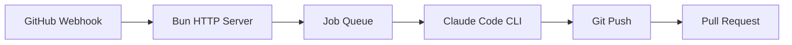
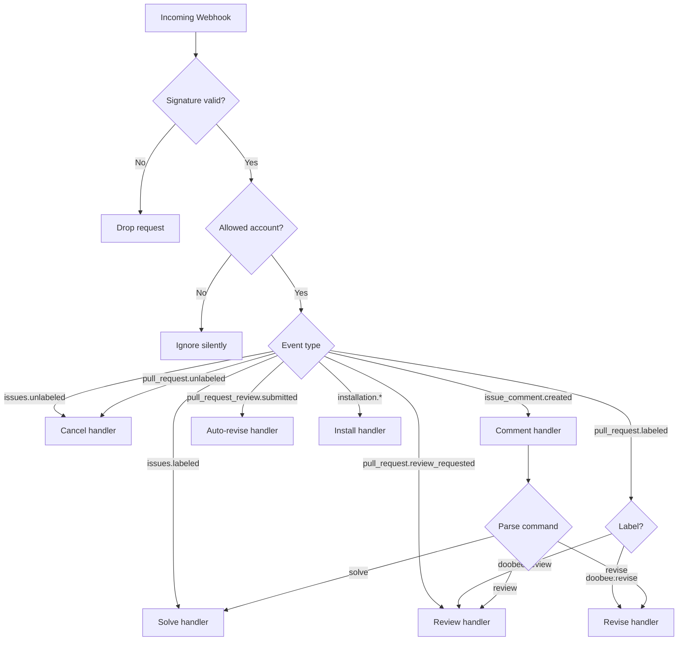
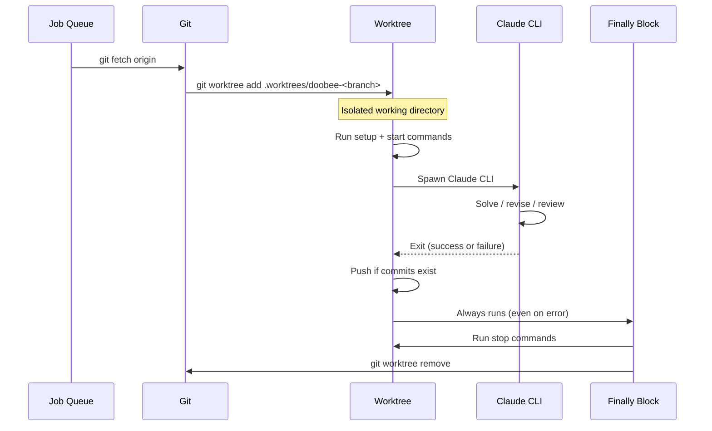

# Architecture

## Overview

Doobee is an event-driven GitHub App. No polling, no cron — webhooks trigger everything.

## Components

| Component | File | Responsibility |
|---|---|---|
| HTTP server | `src/server.ts` | Webhook signature verification, event routing |
| Job queue | `src/queue.ts` | Single-job queue with cancellation support |
| Solve | `src/solve.ts` | Issue → worktree → Claude → PR |
| Revise | `src/revise.ts` | Review feedback → worktree → Claude → push |
| Review | `src/review-pr.ts` | PR diff → Claude → inline comments |
| GitHub API | `src/github.ts` | Octokit wrapper (PRs, labels, comments, reviews, variables) |
| Git ops | `src/git.ts` | Worktree management, branches, push, commit detection |
| Claude CLI | `src/claude.ts` | Spawn Claude, build prompts, parse output markers |
| Config | `src/config.ts` | Load `.doobee.json`, merge with defaults |
| Commands | `src/commands.ts` | Run lifecycle commands (setup, start, stop) |
| Command parser | `src/parse-command.ts` | Parse `@doobeebot` comment commands |

### Handlers

| Handler | File | Webhook event |
|---|---|---|
| Labeled | `src/handlers/labeled.ts` | `issues.labeled` (solve trigger) |
| PR labeled | `src/handlers/pr-labeled.ts` | `pull_request.labeled` (review/revise trigger) |
| Review requested | `src/handlers/review-requested.ts` | `pull_request.review_requested` |
| Comment | `src/handlers/comment.ts` | `issue_comment.created` |
| Review submitted | `src/handlers/review.ts` | `pull_request_review.submitted` (auto-revise) |
| Unlabeled | `src/handlers/unlabeled.ts` | `issues.unlabeled` / `pull_request.unlabeled` (cancel) |
| Install | `src/handlers/install.ts` | `installation.created` / `installation_repositories.added` |

## Webhook routing

The server listens for nine webhook events and routes them to handlers:

## Worktree lifecycle

Every solve, revise, and review job runs in an isolated git worktree. The main checkout is never mutated.

Worktrees live at `<repoDir>/.worktrees/doobee-<branch>`. Created before Claude runs, removed in a `finally` block after — cleanup always happens, even on crashes or cancellation.

## Job queue

Global single-job queue — one Claude session runs at a time. Jobs are in-memory and not persisted; if the server restarts, queued jobs are lost (webhooks can be replayed by re-adding the trigger label).

Each job receives an `AbortSignal` from the queue's `AbortController`. When a job is cancelled (via label removal), the signal fires, killing the Claude process. The `finally` blocks handle cleanup naturally.

Queue behavior:
- **Running job**: `cancel()` aborts the `AbortController`, killing the Claude process
- **Pending job**: `cancel()` removes it from the queue before it starts
- **New job**: enqueued and waits for the current job to finish
