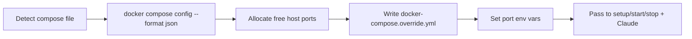

# Configuration

## `.doobee.json`

Create `.doobee.json` in your repo root to configure Doobee's behavior. All fields are optional — if the file is missing, defaults are used. If it exists but contains invalid JSON, the job fails with an error.

See `schema.json` for the full JSON Schema spec.

### Example

```json
{
  "baseBranch": "main",
  "commands": {
    "setup": ["npm ci"],
    "start": ["docker compose up -d"],
    "stop": ["docker compose down"],
    "verify": ["npm run build"],
    "fix": ["npm run lint:fix"]
  },
  "maxRetries": 3,
  "timeout": 3600,
  "model": "claude-sonnet-4-5-20250929",
  "promptContext": "This is a Next.js app with Prisma ORM."
}
```

### Fields

| Field | Default | Description |
|---|---|---|
| `baseBranch` | `"main"` | Branch to create feature branches from |
| `commands.setup` | `[]` | Run once when a worktree is created (e.g. install deps) |
| `commands.start` | `[]` | Run before Claude starts (e.g. start services) |
| `commands.stop` | `[]` | Run after Claude finishes (e.g. tear down services) |
| `commands.verify` | `[]` | Passed to Claude's prompt — Claude runs these to verify the build |
| `commands.fix` | `[]` | Passed to Claude's prompt — Claude runs these to auto-fix lint/format |
| `maxRetries` | `3` | Attempts before Claude gives up and marks stuck |
| `timeout` | `3600` | Max seconds for a Claude invocation before it is killed |
| `model` | — | Claude model override (e.g. `claude-sonnet-4-5-20250929`) |
| `promptContext` | — | Extra context injected into Claude's prompt (repo conventions, stack info) |

**Note:** `commands.setup`, `start`, and `stop` are run by Doobee directly (via `sh -c`). `commands.verify` and `fix` are instructions passed to Claude — Claude decides when and how to run them.

## Environment variables

Copy `.env.example` and fill in your values:

```
APP_ID=123456
PRIVATE_KEY_PATH=./private-key.pem
WEBHOOK_SECRET=your-webhook-secret
REPOS_DIR=./repos
PORT=4567
BOT_NAME=doobeebot[bot]
ALLOWED_ACCOUNTS=myorg,myuser
```

| Variable | Required | Description |
|---|---|---|
| `APP_ID` | Yes | GitHub App ID |
| `PRIVATE_KEY_PATH` | Yes | Path to the `.pem` private key file |
| `WEBHOOK_SECRET` | Yes | Webhook secret set during app creation |
| `REPOS_DIR` | No | Where repos are cloned (default: `./repos`) |
| `PORT` | No | Server port (default: `4567`) |
| `BOT_NAME` | No | Bot login name (default: `doobeebot[bot]`) |
| `ALLOWED_ACCOUNTS` | Yes | Comma-separated GitHub usernames/orgs to allow. If empty, all webhooks are skipped. |

## Repository and organization variables

Doobee reads [GitHub Actions variables](https://docs.github.com/en/actions/writing-workflows/choosing-what-your-workflow-does/store-information-in-variables) from both the organization and the repository, then passes them as environment variables to setup/start/stop commands and Claude's process. Repo variables take precedence over org variables.

This is useful for credentials or configuration that setup scripts need (e.g. private package auth tokens).

### Setup

1. Add the **Variables: Read** repository permission and **Organization variables: Read** organization permission to your GitHub App
2. Add variables in your org or repo settings (**Settings > Secrets and variables > Actions > Variables**)
3. Reference them in your setup scripts as normal env vars

### Example

If your repo needs authentication for a private Composer registry, add `NOVA_USER` and `NOVA_PASSWORD` as repo variables, then use them in your setup script:

```bash
# scripts/setup.sh
if [ -n "$NOVA_USER" ] && [ ! -f auth.json ]; then
  composer config http-basic.nova.laravel.com "$NOVA_USER" "$NOVA_PASSWORD"
fi
composer install
```

If permissions are not granted, Doobee continues without those variables (logs a warning and degrades gracefully).

## Docker port isolation

When running jobs in a worktree, Doobee can remap Docker Compose ports to avoid conflicts with other running services.



### How it works

1. Before running commands, `isolateDockerPorts()` checks for a compose file (`compose.yml`, `docker-compose.yml`, etc.)
2. Runs `docker compose config --format json` to parse all port mappings
3. Allocates a free host port for each published port
4. Writes `docker-compose.override.yml` with `!reset` tags to replace port mappings
   - If the repo already has a `docker-compose.override.yml`, writes to `.doobee-compose-ports.yml` and sets `COMPOSE_FILE` to chain both
5. Scans the raw compose file for `${VAR:-default}` patterns where the default matches a remapped port, then sets those env vars to the new ports
6. Port env vars are passed to all commands and Claude's process — the system prompt includes port assignments so Claude knows which ports to use

Override file is auto-cleaned when the worktree is removed. No compose file or no ports = no-op.

### Variable precedence

When env vars are merged for commands and Claude:

1. Docker port env vars (highest precedence)
2. Repository variables
3. Organization variables (lowest precedence)
