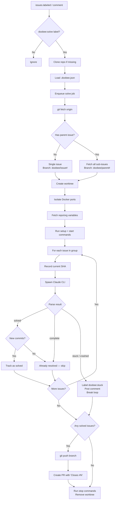
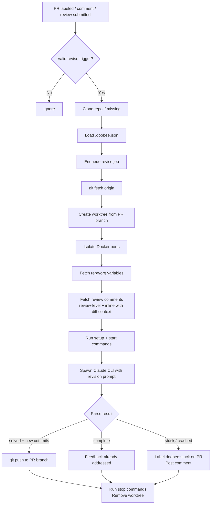
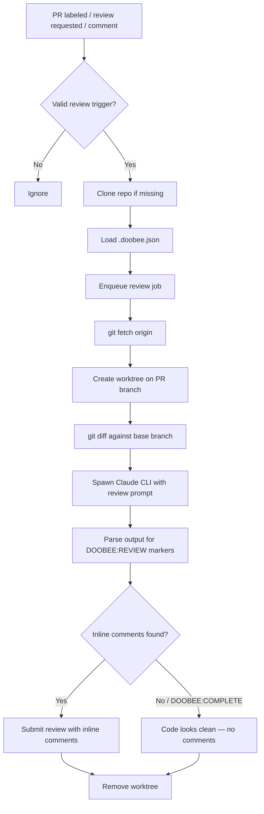
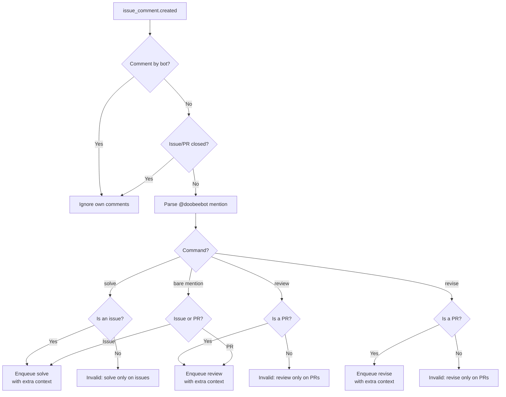
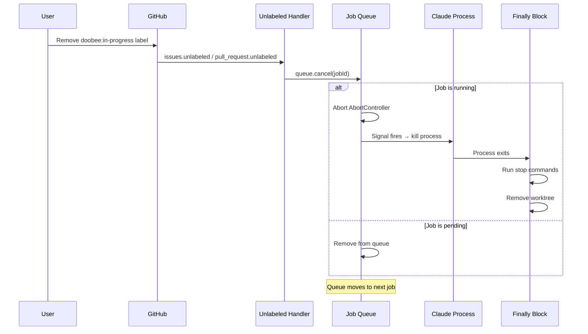

# Flows

Detailed diagrams for every Doobee workflow.

## Solve flow

Triggered by: `doobee:solve` label on an issue, or `@doobeebot solve` comment.

## Revise flow

Triggered by: `doobee:revise` label on a PR, `@doobeebot revise` comment, or "Request changes" review on a bot PR.

When triggered by the `doobee:revise` label, all reviews with `changes_requested` state are collected. When triggered by a specific review webhook, only that review's comments are fetched.

## Review flow

Triggered by: `doobee:review` label on a PR, bot added as reviewer, or `@doobeebot review` comment.

Review is read-only — Claude does not modify files. Comments focus on correctness, bugs, and logic errors — not style.

## Comment routing

Triggered by: `issue_comment.created` webhook with an `@doobeebot` mention.

Text after the command (e.g. `@doobeebot solve focus on the API layer`) becomes extra context in Claude's prompt.

## Cancellation

Triggered by: removing the `doobee:in-progress` label from an issue or PR.

