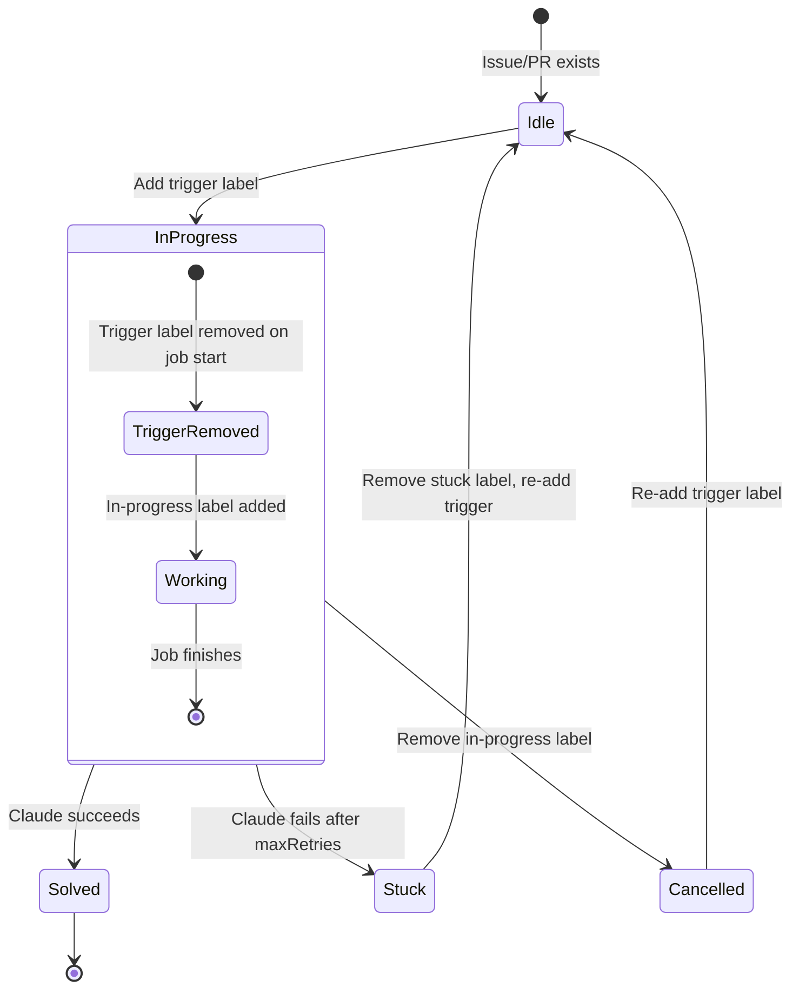

# Usage

## Triggering Doobee

### Solve an issue

Add the `doobee:solve` label to an issue, or comment `@doobeebot solve`. Doobee creates a branch, spawns Claude to solve the issue, and opens a PR.

### Review a PR

Add the `doobee:review` label to a PR, add `doobeebot[bot]` as a reviewer, or comment `@doobeebot review`. Doobee reviews the diff and posts inline comments focusing on correctness, bugs, and logic errors — not style. If the code looks clean, no comments are posted.

### Revise a PR

Add the `doobee:revise` label to a PR, or comment `@doobeebot revise`. Doobee reads all review comments (including inline feedback with file paths, line numbers, and diff context), spawns Claude to address them, and pushes fixes to the same branch.

Revise also auto-triggers when a reviewer submits "Request changes" on a Doobee PR.

## Comment commands

Comment on an issue or PR to trigger Doobee directly:

| Command | Where | Action |
|---|---|---|
| `@doobeebot solve` | Issue | Trigger solve (same as labeling `doobee:solve`) |
| `@doobeebot review` | PR | Trigger a code review |
| `@doobeebot revise` | PR | Trigger revision (address review feedback) |
| `@doobeebot` | Issue | Defaults to solve |
| `@doobeebot` | PR | Defaults to review |

Text after the command becomes extra context in Claude's prompt:

```
@doobeebot solve focus on the API layer
```

## Sub-issues

For sub-issues (GitHub's native hierarchy), Doobee detects the parent, fetches all siblings, and processes them sequentially on a shared branch (`doobee/<parent#>`). If all sub-issues are solved, the parent issue number is included in the PR's `Closes` list. If some sub-issues get stuck, the PR title gets a `(partial)` suffix.

## Cancellation

Remove the `doobee:in-progress` label from an issue or PR to immediately cancel. This kills the running Claude process, cleans up the worktree, runs stop commands, and moves the queue to the next job. If the job is still queued (not yet started), removing the label dequeues it.

## Stuck handling

If Claude can't resolve an issue after `maxRetries` attempts, Doobee:

1. Adds the `doobee:stuck` label
2. Posts a comment explaining why
3. Skips any remaining sub-issues in the group

To retry: remove `doobee:stuck`, fix the issue description if needed, and re-add the `doobee:solve` label.

## Label lifecycle



Trigger labels (`doobee:solve`, `doobee:review`, `doobee:revise`) are removed when the job starts. This means re-adding the label re-triggers the action. The `doobee:in-progress` label is added while Doobee is working and removed when done.

## Job queue

Global single-job queue — one Claude session at a time. The queue is in-memory; if the server restarts, queued jobs are lost. Re-trigger by re-adding the appropriate label.
